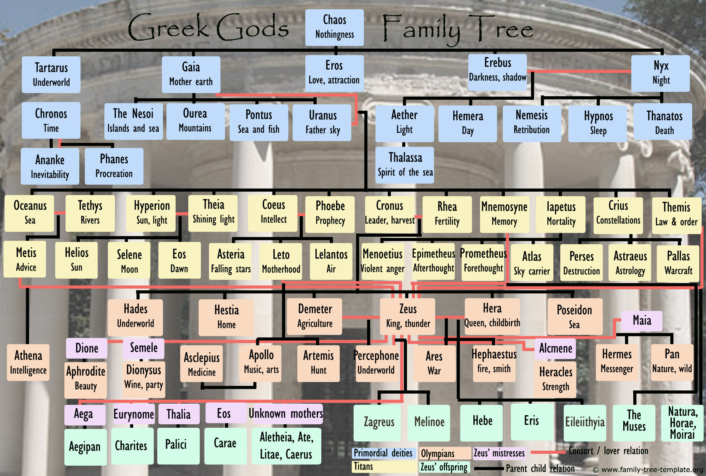

Perhaps the complicate relationship between gods and godnesses in greek mythology is what prevents me most from these attractive stories. So I want to draw a family tree for them. The final work would be like: 

--- 

### Features

- [ ] static family tree graph
    - [ ] mother + father -> several children
    - [ ] mother + child -> several children 
- [ ] dynamic features
    - [ ] pop up box with more information

---

### Links

- [Directed Acyclic Graph](https://github.com/erikbrinkman/d3-dag)
- This is [one](http://jsfiddle.net/cyril123/0vbtvoon/22/) maybe useful
